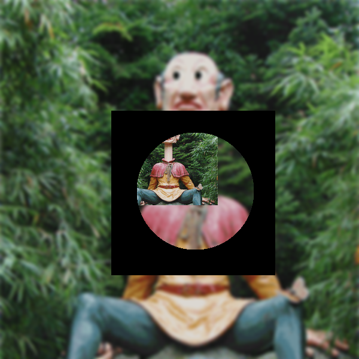

This project needs Imagick https://www.php.net/manual/en/book.imagick.php

# Run the project

```sh
docker-compose up
```

Then open the browser to http://localhost

Steps:

1. create an empty image
2. Resize the image below and add blur to it, then set it as background

3. Add the image in the middle of the screen (over the background)
4. Add a mask over the final result (sorry but my mask is smaller than the final resolution, it should be the same size)

6. The result

